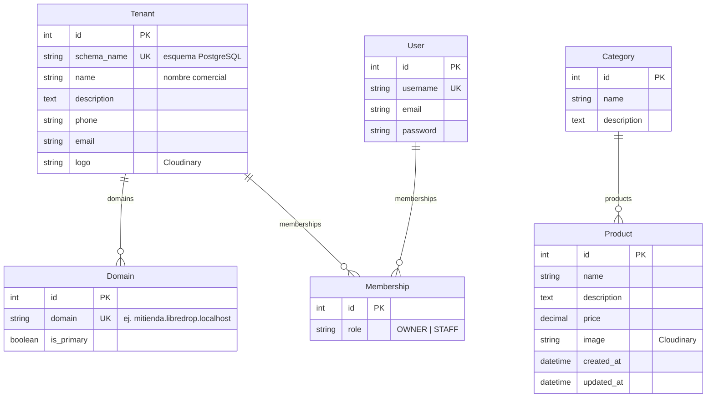

# LibreDrop

LibreDrop es una plataforma open source para crear tiendas online simples. Hecha en Guatemala bajo licencia AGPLv3.

- Crea tu tienda, publica productos y recibe pedidos por WhatsApp.
- Sin intermediarios ni comisiones. Tú controlas tus datos y API keys.
- Arquitectura modular con Django y Django REST Framework.
- Multi-tenant: cada tienda aísla sus categorías y productos en un esquema propio.
- Registro en un solo paso: al crear el usuario se genera su tienda, esquema y dominio automáticamente.
- API de catálogo: CRUD de categorías y productos por tienda (backend de v1 terminado).

## Stack

| Capa | Tecnología |
| --- | --- |
| Backend | Python 3.12+, Django 6, DRF |
| Autenticación | JWT (djangorestframework-simplejwt) |
| Base de datos | PostgreSQL (requerido por django-tenants) |
| Imágenes | Cloudinary |
| API | REST |
| Landing pages | HTML, CSS y JS vanilla (deploy en Vercel) |

## Requisitos

- Python 3.12+
- pip

## Instalación

```bash
# Clonar el repositorio
git clone git@github.com:Sebas16608/LibreDrop.git
cd LibreDrop/backend

# Crear y activar entorno virtual
python -m venv .venv
source .venv/bin/activate  # Linux/Mac
# .venv\Scripts\activate   # Windows

# Instalar dependencias
pip install -r requirements.txt

# Configurar variables de entorno
cp .env.example .env
# Edita .env con tus credenciales (requiere PostgreSQL)

# Migrar base de datos
python manage.py migrate

# Iniciar servidor de desarrollo
python manage.py runserver
```

> **Nota sobre la base de datos:** el proyecto usa **django-tenants**, que requiere **PostgreSQL** (las tiendas se aíslan en esquemas propios). No es compatible con SQLite. Las credenciales se configuran con `DB_NAME`, `DB_USER`, `DB_PASSWORD`, `DB_HOST` y `DB_PORT`.

## Configuración

Copia `.env.example` a `.env` y completa las variables:

| Variable | Descripción |
| --- | --- |
| `SECRET_KEY` | Clave secreta de Django |
| `DEBUG` | `True` para desarrollo |
| `ALLOWED_HOSTS` | Hosts permitidos (separados por comas) |
| `CLOUDINARY_CLOUD_NAME` | Tu cloud name de Cloudinary |
| `CLOUDINARY_API_KEY` | Tu API key de Cloudinary |
| `CLOUDINARY_API_SECRET` | Tu API secret de Cloudinary |
| `DB_NAME` | Nombre de la base de datos |
| `DB_USER` | Usuario de la base de datos |
| `DB_PASSWORD` | Contraseña de la base de datos |
| `DB_HOST` | Host de la base de datos |
| `DB_PORT` | Puerto de la base de datos |

## Estructura del proyecto

```
LibreDrop/
├── backend/          # API REST (Django)
│   ├── backend/      # Configuración del proyecto Django (settings, urls)
│   ├── accounts/     # Registro, login y gestión de usuarios
│   ├── tenants/      # Multi-tenant (Tenant, Domain, Membership)
│   ├── catalog/      # Categorías y productos
│   ├── customers/    # Clientes
│   └── orders/       # Pedidos (WhatsApp)
└── docs/             # Documentación técnica
```

## Apps

| App | Descripción |
| --- | --- |
| `accounts` | Registro, inicio de sesión y gestión de usuarios |
| `tenants` | Multi-tenant: `Tenant`, `Domain` y `Membership` (django-tenants) |
| `catalog` | API de categorías y productos (modelos de tenant) |
| `customers` | Clientes *(pendiente, se abordará en futuras versiones)* |
| `orders` | Pedidos y líneas de pedido *(pendiente, se abordará en futuras versiones)* |

## Modelo de datos

Diagrama entidad-relación (ERD) con los modelos actuales del MVP:



> Los modelos `User`, `Tenant`, `Domain` y `Membership` viven en el esquema `public`; `Category` y `Product` en el esquema de cada tenant.

## API

Endpoints principales del backend:

| Endpoint | Descripción | Permisos |
| --- | --- | --- |
| `POST /accounts/register/` | Registro en un paso: usuario + tienda + esquema + dominio + membresía `OWNER` | Público |
| `POST /accounts/token/` | Login JWT | Público |
| `/tenants/`, `/domains/`, `/memberships/` | Gestión de tiendas, dominios y miembros | `IsTenantMember` / `IsTenantOwner` |
| `/category/`, `/products/` | CRUD del catálogo de la tienda | Lectura pública; escritura: autenticado + `IsTenantMember` |

## Documentación

- [VERSIONS.md](docs/VERSIONS.md) — versionado y características del proyecto.
- [DATABASE.md](docs/DATABASE.md) — modelo de datos y arquitectura multi-tenant.
- [CONTRIB.md](docs/CONTRIB.md) — guía para contribuir.

## Contribuciones

¡Gracias por tu interés en contribuir a LibreDrop! Antes de empezar, consulta [CONTRIB.md](docs/CONTRIB.md) para la guía completa.

Pasos rápidos:

1. Haz un fork del repositorio.
2. Crea una rama con un nombre descriptivo (`git checkout -b feature/nueva-funcionalidad`).
3. Realiza tus cambios y añade tests si es necesario.
4. Asegúrate de que pasen los tests y linters.
5. Haz un pull request describiendo los cambios.

## Licencia

AGPLv3 — ver [LICENSE](LICENSE).
